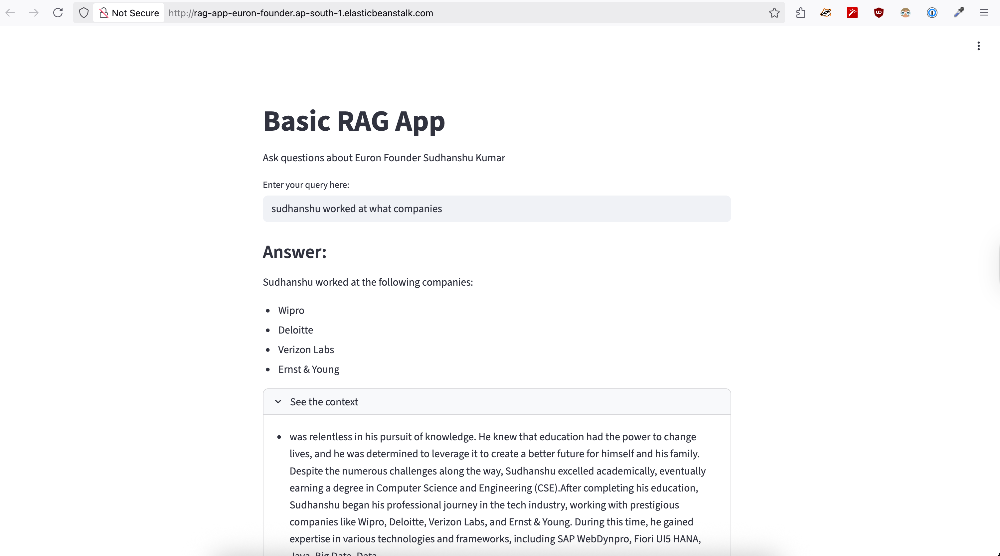

# Basic Rag App
This app is created without use of any llm framework.

## Library / Packages used
- Numpy (for vector operations)
- FAISS-CPU (as vector search engine)
- typing (for type hinting)
- python-dotenv (for loading environment variables)

## How to install and run
- run command `pip install -r requirements.txt` or `uv venv && uv sync`
- rename `env.sample` file in root directory to `.env`
- update `.env` file with your own api key values
- run command `uv run streamlit run app.py`
- open url in browser `http://localhost:8501`
- **Dockerfile also present if want to use Docker for deployment.**

## How to deply on AWS Elastic Beanstalk
- Create a zip file of the project after removing:
  - `.venv`
  - `.git`
  - `.idea`
  - `.ruff`
- Add Env variable inside your Elastic Beanstalk Environment configuration
- upload zip file to Elastic Beanstalk Environment

## Post Deployment picture
